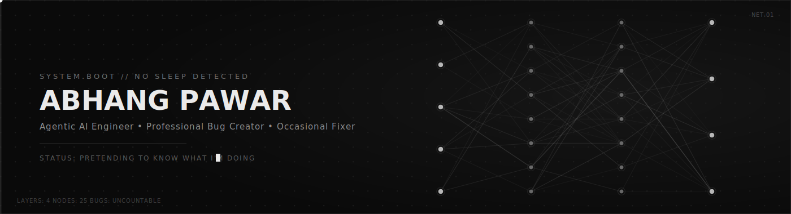

 

 

## `01` About

  

I'm an AI Solution Builder, which is a fancy way of saying I make chatbots that
occasionally do what they're told. Currently at **Ernst & Young**, teaching multiple
AI agents to cooperate — a skill my college group projects never quite managed.

- 🔭 Building agentic assistants that need human approval, because *nobody* trusts the AI. Including me.
- 🌱 Learning LangGraph orchestration and quantized fine-tuning, mostly by breaking things first
- 🏆 Won ₹1,00,000 at a hackathon once. It's gone now. Worth it.
- 📫 `abhangpawar03@gmail.com` (replies not guaranteed to be sarcasm-free)

## `02` Experience

 

**AI Solution Builder** · Ernst & Young (EY) — *May 2026 – Jul 2026*
> Built a 3-agent wealth-management assistant. One agent scrapes news, one asks an LLM
> for suggestions, one plays compliance officer and vetoes half of them. Wired it all
> together with LangGraph, Redis, PostgreSQL, and a React dashboard so humans could
> pretend they're still in control.
> *Nobody got fired. Yet.*

**AI Team Lead → AI Developer** · Akai Space Hybrid — *Jan 2025 – Nov 2025*
> Led two teams into building automated image/audio labeling pipelines. Turns out
> "team management" mostly means answering "is it done yet" in different tones of voice.
> Also shipped a video labeling pipeline with FastAPI, LLM-as-Judge, and a CI/CD setup
> that broke exactly once a week, like clockwork.

**Point of Contact, IIIT Dharwad Website** — *May 2025 – Present*
> Improved site performance and UI/UX. The site now loads fast enough that people
> notice the content is still mid.

**Google Student Ambassador** — *Aug 2025 – Dec 2025*
> Convinced strangers that Gemini is cool. Some of them believed me.

## `03` Projects

 

**Intune** — *a real-time MLOps pipeline that fine-tunes itself so I don't have to*
Built an incremental knowledge-distillation setup that continuously fine-tunes a
compact LLM (`gemma3:1B`) using a much bigger, much smugger teacher model (`oss:20B`),
via 4-bit quantized LoRA on rolling 5k-sample checkpoints. Also built 11 evaluation
metrics because "trust me, it got better" isn't a valid research claim.
`Python · Hugging Face · Kafka · Spark Streaming · Supabase · LoRA · LLMOps`
[Demo](#) · [Research Paper](#)

**Dream11 Team Predictor** — *for when gut feeling loses too much money*
A Gradient Boosting Regressor picks the best playing XI post-toss, then a linear
programming optimizer respects the budget I clearly can't. Containerized, because
even my questionable fantasy-sports decisions deserve to scale.
`Python · Data Science · Docker`
[Demo](#)

## `04` Stack

*(a.k.a. things I've broken enough times to understand)*

 

**AI / ML — where the "intelligence" is aspirational**
 

**Web Development — the part people actually see**
 

**Data / Infra — where bugs go to hide**
 

**Languages — for when I need to argue with a compiler instead of a person**
 

## `05` Metrics

*(the numbers GitHub uses to judge me)*

 

## `06` Connect

*(mostly to tell me my code doesn't work)*

 

 

`EOF — thanks for reading this far. go touch grass.`

