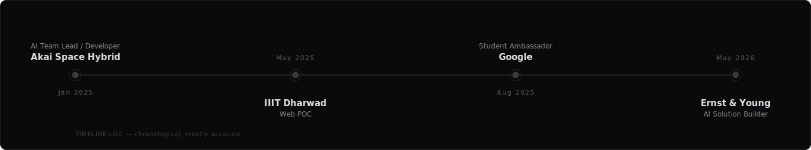

 

 

## `01` About

  

AI Solution Builder currently at **Ernst & Young**, designing multi-agent systems that pair
LLM reasoning with rule-based guardrails. I like the seam between research and production —
taking an agent pipeline from a notebook to a Dockerized service with a real UI in front of it.

- 🔭 Building agentic assistants with human-in-the-loop approval flows
- 🌱 Deep in LangGraph orchestration, LLMOps, and quantized fine-tuning (LoRA)
- 🏆 Winner, FIFS Gameathon 2.0 (₹1,00,000 prize) · Finalist, Aventus 3.0 · Winner, Monad Blitz
- 📫 `abhangpawar03@gmail.com`

## `02` Experience

 

**AI Solution Builder** · Ernst & Young (EY) — *May 2026 – Jul 2026*
> Built a 3-agent wealth-management assistant: a lead-feed agent (news + scraping), an LLM
> suggestion agent (OpenAI + Pydantic-validated output), and a rule-based diversification
> engine — all wired through a LangGraph orchestrator with human-in-the-loop approval,
> Redis as a hot workflow bus, PostgreSQL cold storage, and a React dashboard on FastAPI.

**AI Team Lead → AI Developer** · Akai Space Hybrid — *Jan 2025 – Nov 2025*
> Led two teams building automated labeling pipelines (image + audio). Shipped an AI video
> labeling pipeline with FastAPI, LLM-as-Judge prompt tuning, MongoDB, and a Jenkins →
> Docker → EC2 CI/CD pipeline.

**Point of Contact, IIIT Dharwad Website** — *May 2025 – Present*
> Improved site performance and UI/UX using Next.js, TypeScript, and Sanity.

**Google Student Ambassador** — *Aug 2025 – Dec 2025*
> Organized technical events promoting Google Gemini.

## `03` Projects

 

**Intune** — *real-time MLOps pipeline*
Incremental knowledge-distillation framework that continuously fine-tunes a compact LLM
(`gemma3:1B`) against a stronger teacher (`oss:20B`), using 4-bit quantized LoRA on
sequential 5k-sample checkpoints. Built 11 custom evaluation metrics to track student-model
improvement across batch and incremental training.
`Python · Hugging Face · Kafka · Spark Streaming · Supabase · LoRA · LLMOps`
[Demo](#) · [Research Paper](#)

**Dream11 Team Predictor**
ML system predicting the best playing XI post-toss: a Gradient Boosting Regressor on
historical player data, feeding a linear-programming optimizer for credit/budget-constrained
team selection. Containerized for deployment — because even fantasy-sports picks deserve
a proper pipeline.
`Python · Data Science · Docker`
[Demo](#)

## `04` Stack

 

 

 

 

## `05` Metrics

 

## `06` Connect

 

 

`EOF — end of profile`

